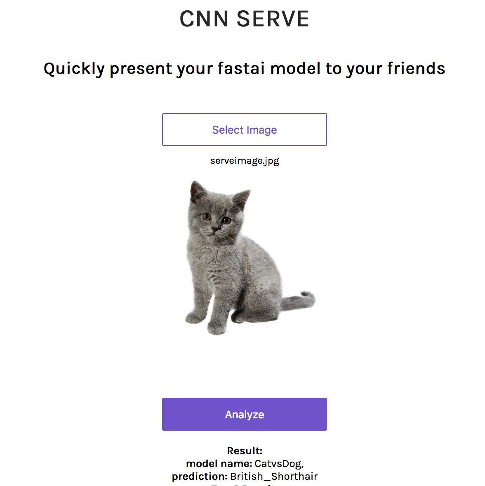

### Install

```
# Easiest installation is with pipenv, 
# Alternatively check dependencies in Pipfile manually.
git clone https://github.com/jotron/CNN_Deploy/
cd CNN_Deploy
pipenv install

# Fill in corresponding Information in modelDefinition.json
# Place saved model in /models
pipenv run python app/server.py serve
```

\**Checkout the result in your local network or on your computer.*

Based on [Pytorch-Serving](https://github.com/cedrickchee/pytorch-serving).

